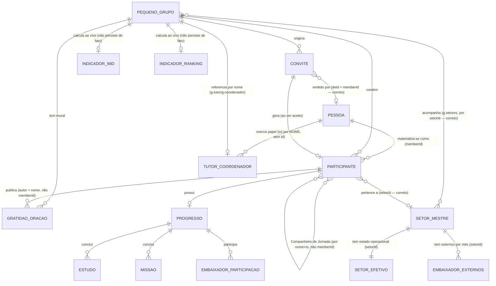

# ARQ-002 — Modelo Conceitual do Domínio (somente diagnóstico)

> Realizado em 2026-07-30, na sequência da ARQ-001. Escopo: catalogar as entidades reais do
> domínio "Jornada Discipular em Pequenos Grupos" a partir do código (`index.html`) e da
> documentação já homologada (`ARCHITECTURE.md`), independente de como cada uma está guardada
> hoje (Firestore/localStorage/memória) — esse é assunto do ARQ-004 (Persistência), não deste
> documento. **Nenhum código foi alterado.**
>
> Este documento descreve **o que existe hoje**, com as ambiguidades que existem hoje marcadas
> explicitamente como ambiguidade — não é uma proposta de como o modelo "deveria" ser. Onde o
> código responde de forma inconsistente uma das perguntas conceituais, isso está registrado
> como **achado de modelagem**, não corrigido silenciosamente.

---

## Como ler este documento

Cada entidade segue a mesma ficha:

- **Descrição** — o que ela representa no negócio, não na tela.
- **Papéis possíveis** — variações que a mesma entidade assume (quando aplicável).
- **Identificador canônico** — o campo que identifica um registro de forma estável e permanente,
  ou `(a definir)` quando não existe.
- **Campos obrigatórios / opcionais** — conforme o código realmente trata (não conforme seria
  desejável).
- **Relacionamentos** — com quais outras entidades, e a cardinalidade real observada.
- **Restrições** — regras de negócio que o código impõe hoje.
- **Evidência** — função/arquivo/linha de onde a ficha foi extraída.

---

## 1. Pessoa *(entidade conceitual — não existe como um único objeto no código)*

**Descrição:** qualquer indivíduo que interage com o sistema — participante de PG, tutor,
coordenador. É o conceito que unifica o que hoje são **três representações diferentes e sem
vínculo formal entre si** no código (ver "Achado de Modelagem 1", abaixo).

**Papéis possíveis:** Participante · Tutor · Coordenador · **Administrador não existe** (busca
por `papel === 'admin'`/equivalente no arquivo não retorna nenhuma ocorrência — confirmado
também na ARQ-001). Um mesmo indivíduo pode acumular papéis diferentes em PGs diferentes
(ex.: Tutor do PG 3, participante comum do PG 9 pessoalmente) — não há nada que impeça isso.

**Identificador canônico:** **(a definir)** — não existe hoje um identificador único de Pessoa
que amarre as três representações abaixo. É exatamente o gap já registrado no
`ESTADO-E-ROADMAP.md` como "RC4 — Identidade Canônica dos Responsáveis", planejada, não
iniciada.

**As três representações hoje (evidência):**

| Representação | Onde vive | Identificador usado |
|---|---|---|
| Participante | `g.participantes[]` | `memberId` (UUID, estável) |
| Tutor do grupo | `g.tutor` (string) + array de topo `TUTORS[]` | **nome** (casado por `nomesCorrespondem()`, prefixo de palavra) |
| Coordenador do grupo | `g.coordenador` (string) | **nome** (mesmo mecanismo) |

**Relacionamentos:** participa de Pequeno Grupo · exerce Papel (Tutor/Coordenador) · possui
Progresso (Estudos/Missões/Embaixadores) · relaciona-se com Companheiro de Jornada.

**Restrições:** nenhuma — é justamente a ausência de restrição/vínculo formal entre as três
representações que caracteriza o gap.

**Evidência:** `getGruposDoResponsavel`/`nomesCorrespondem` (index.html:2967+),
`ESTADO-E-ROADMAP.md:89-107` (RC4, já planejada para fechar esta lacuna).

---

## 2. Participante

**Descrição:** o registro concreto de uma Pessoa dentro de um Pequeno Grupo específico — hoje a
única das três representações de Pessoa que tem identificador estável.

**Papéis possíveis (campo `tipo`):** `'tutor'` · `'coordenador'` · `'colaborador'` (funcionário
do hospital) · `'amigo'` (amigo dos Adventistas) · `'membro'` (membro IASD) — 5 valores
observados no código, não documentados centralmente em nenhuma constante (`STUDIES`-like);
aparecem espalhados como string literal em várias telas (index.html:3608-3612, 9513, 11196).

**Identificador canônico:** `memberId` (UUID gerado no dispositivo, `crypto.randomUUID()`
presumível via `uuid()`) — estável **desde que o `localStorage` do dispositivo não seja
limpo** (ver ARQ-001, Pilar Identidade).

**Campos obrigatórios (sempre presentes na criação, `confirmarEntradaConvite`,
index.html:8489-8492):** `nome`, `wa` (WhatsApp, prefixado `55`), `tipo`, `dataInscricao`
(string `DD/MM/AAAA`, não ISO), `ts` (timestamp numérico de criação), `memberId`.

**Campos opcionais:** `papel` (`'tutor'`\|`'coordenador'`\|`null` — ver Achado de Modelagem 2),
`departamento` (só relevante se `tipo==='colaborador'`), `progresso` (objeto aninhado, só existe
depois da primeira ação de estudo/missão/oração), `compParceiro[]`/`compConvites[]`
(Companheiro de Jornada), `setorId` (setor institucional do colaborador), `removed`+`updatedAt`
(tombstone, só existe se já foi removido).

**Relacionamentos:** pertence a exatamente 1 Pequeno Grupo (`grupoNum`) · pode ter até 2
Companheiros de Jornada · pode estar vinculado a 1 Setor · gera entradas no Mural (Gratidão/
Oração) como **autor por nome**, não por `memberId` (ver Achado de Modelagem 3).

**Restrições:** IDENT-01 (index.html:8478-8494) tenta recuperar um cadastro existente por
nome+WhatsApp antes de criar um duplicado, ao aceitar convite num aparelho novo — mitiga, não
elimina, duplicação. Remoção usa tombstone (`removed:true`), nunca apagamento imediato — 30 dias
de retenção antes da poda definitiva.

**Evidência:** criação em `confirmarEntradaConvite` (8460-8528); tombstone (8037-8041);
exibição de `tipo` (3608-3612).

---

## 3. Papel: Tutor / Coordenador

**Resposta às perguntas do usuário — "Tutor é um papel ou um tipo de pessoa? Coordenador é
pessoa ou função temporária?"**

Pelo código, **os dois são papéis** (atributo de um Participante), não entidades próprias —
evidência: o mesmo campo `papel` no mesmo objeto Participante assume `'tutor'` ou `'coordenador'`
(index.html:8490); a UI trata como "a mesma pessoa, com um rótulo a mais" (9513).

**Mas o código se contradiz em outro ponto:** o PG também guarda `g.tutor`/`g.coordenador` como
**strings soltas de nome**, **fora** do array de participantes — ou seja, na prática, hoje
convivem duas modelagens diferentes ao mesmo tempo: "papel é atributo do Participante" (correto,
consistente com `memberId`) e "tutor/coordenador é um campo solto do Grupo, identificado por
nome" (a representação usada por toda a lógica de autorização/exibição do Painel do Tutor,
`getGruposDoResponsavel`). **Não é temporário no sentido de ter validade — não há campo de
início/fim de mandato; é permanente até alguém reatribuir manualmente.**

**Identificador canônico:** nome (string) — ver Achado de Modelagem 1.

**Restrições:** um grupo tem no máximo 1 Tutor e 1 Coordenador simultâneos (`g.tutor`/
`g.coordenador` são campos escalares, não arrays); nada impede a mesma pessoa (por nome) de ser
Tutor de mais de um PG ao mesmo tempo.

**Evidência:** `PEQUENOS_GRUPOS` (8000-8012, campos `tutor`/`coordenador` como string única),
comparado com `p.papel` (8490).

---

## 4. Administrador

**Descrição:** **não existe** como papel no sistema. Confirmado por ausência total de
`papel === 'admin'`, `role === 'admin'`, ou equivalente em todo o arquivo (busca já feita na
ARQ-001, reconfirmada aqui). Qualquer Tutor/Coordenador tem, na prática, o mesmo nível de acesso
que teria um administrador — não há hierarquia entre eles.

**Identificador canônico:** não aplicável (entidade inexistente).

---

## 5. Pequeno Grupo (PG)

**Descrição:** a unidade organizacional central do sistema — um grupo de discipulado com até um
Tutor, um Coordenador e N participantes.

**Identificador canônico:** `num` (inteiro, 1 a 50, **fixo desde a inicialização do array**, não
reaproveitável) — este é o único identificador do sistema que já nasceu correto (estável,
imutável, nunca reciclado): `PEQUENOS_GRUPOS = Array.from({length:50}, ...)`.

**Campos obrigatórios:** `num` (sempre presente, gerado na inicialização).

**Campos opcionais (todos `null`/vazio até alguém preencher):** `nome`, `tutor`, `coordenador`,
`diaReuniao`, `horaReuniao`, `maxParticipantes` (`null` = ilimitado), `participantes[]`,
`gratidoes[]`, `reunioesMes{}`, `setores[]`, e (não persistidos de forma confiável hoje, ver
ARQ-001/AUD-003) `pgProgress`, `pgNivel`, `pgIMD`, `pgRanking`.

**Relacionamentos:** contém N Participantes · referencia (por nome) 1 Tutor + 1 Coordenador ·
referencia (por `setorId`) N Setores acompanhados · contém seu próprio Mural (Gratidões/Orações)
· contém seu próprio histórico de encontros (`reunioesMes`).

**Restrições:** número de PGs é fixo em 50 (array de tamanho fixo, não há "criar novo PG" além
dos 50 pré-alocados) — um "PG" sem nome ainda é um PG válido, só sem identidade visível
(`PG_DEFAULT_NAME + N`, conforme `ARCHITECTURE.md`, "Decisões Arquiteturais Consolidadas").
`maxParticipantes` existe como campo mas nenhuma função de inscrição encontrada nesta auditoria
o valida (candidato a achado funcional, fora do escopo conceitual deste documento).

**Evidência:** index.html:7996-8012.

---

## 6. Convite

**Descrição:** o mecanismo pelo qual uma Pessoa entra num Pequeno Grupo, ou assume um papel
(Tutor/Coordenador) nele — é o elo formal entre Pessoa e Grupo antes de existir um Participante.

**Identificador canônico:** `inviteId` (UUID) — **corretamente modelado**, mesmo padrão de
`memberId`.

**Campos obrigatórios:** `inviteId`, `versaoConvite`, `tipo`, `funcao`, `grupoNum`, `grupoNome`,
`status` (`'pendente'`\|`'utilizado'`\|outros estados de ciclo de vida), `criadoEm`, `expiraEm`,
`updatedAt`.

**Campos opcionais:** `deId`/`deNome` (quem convidou, pode ser `null` — ex.: convite gerado por
link genérico), `paraWa` (WhatsApp de destino, se convite nominal), `usadoPor`/`usadoEm` (só
após aceite).

**Relacionamentos:** referencia 1 Pequeno Grupo (`grupoNum`) · referencia opcionalmente a Pessoa
emissora (`deId` = `memberId`, **este sim referenciado corretamente por id, não por nome**) ·
gera 1 Participante ao ser aceito.

**Restrições:** expira (`expiraEm`, TTL configurável) · poda automática de convites antigos
(`podarConvites`) · merge por `inviteId` com regra de "transição válida" (`mergeConvites`,
8332+) para resolver concorrência entre dispositivos.

**Evidência:** `criarConviteObj` (8257-8269), aceite (8460-8528).

**Nota de modelagem:** o Convite é, hoje, **a entidade com o modelo de identificação mais
maduro do sistema** (UUID + versão + ciclo de vida + merge dedicado) — vale como referência de
padrão para as demais entidades, não só como algo a corrigir.

---

## 7. Companheiro de Jornada *(relacionamento, não entidade própria)*

**Descrição:** vínculo de acompanhamento espiritual mútuo entre 2 (ou excepcionalmente 3, em
"trio") participantes do mesmo PG. Confirma a intuição do usuário — **é um relacionamento
Pessoa↔Pessoa, não uma entidade com identidade própria**; vive inteiramente como campos dentro
do Participante.

**Identificador canônico:** não aplicável (é uma aresta do grafo, não um nó) — mas **a forma como
a aresta referencia o outro lado é frágil**: `compParceiro[]` guarda `{ nome, ts }` do parceiro,
**não `memberId`** (ver Achado de Modelagem 3).

**Campos envolvidos:** `p.compParceiro[]` (até 2 entradas — regra de negócio, `cpParceiros`,
6533-6535) · `p.compConvites[]` (convites pendentes de companheirismo, `{ de, deTs, ts }`).

**Relacionamentos:** N:N limitado a 2 (ou 3 em trio) entre Participantes do **mesmo** PG — não
foi encontrada nenhuma checagem impedindo companheirismo entre PGs diferentes além do fato de
`cpMyGroup()`/`cpFindParticipant(g, ...)` já restringirem a busca ao próprio grupo.

**Restrições (todas confirmadas em `inviteCompanion`/`acceptCompanion`, 6556-6624):** máximo 2
companheiros por pessoa · trio só permitido se o PG tiver número ímpar de participantes
(`cpGrupoImpar`) · só 1 trio por PG · convite duplicado do mesmo remetente é bloqueado.

**Evidência:** 6531-6624.

---

## 8. Setor — Cadastro Mestre

**Descrição:** identidade institucional de um setor do hospital (RH, Jurídico, DP, NCP etc.) —
já teve o desenho formalizado em ADR-001 (`ARCHITECTURE.md`), reconfirmado aqui sem alteração.

**Identificador canônico:** `setorId` — **corretamente modelado** (estável, nunca reaproveitado,
mesmo padrão do `inviteId`).

**Campos obrigatórios:** `setorId`, `nome`.

**Campos opcionais (reservados, sem leitura ainda — confirmado inalterado nesta auditoria):**
`ativo`, `departamentoPaiId`.

**Relacionamentos:** referenciado por Setor Efetivo (mesmo `setorId`) · referenciado por
`g.setores[]` (Setor Acompanhado pelo PG) · referenciado por `p.setorId` (Participante).

**Restrições:** exclusão bloqueada enquanto existir participante vinculado (`excluirSetor`).

**Evidência:** `ARCHITECTURE.md:120-125`, ADR-001.

---

## 9. Setor — Efetivo Institucional

**Descrição:** quantos colaboradores um setor tem hoje — estado operacional, deliberadamente
separado da identidade (ADR-001) por mudar com o tempo.

**Identificador canônico:** `setorId` (referência ao Cadastro Mestre — o registro em si não tem
id próprio como "linha", é uma entrada indexada por `setorId`).

**Campos obrigatórios:** `setorId`, `totalColaboradores`, `atualizadoEm`.

**Campos opcionais:** `historico[]` — **append-only por design**: cada entrada é
`{registroId, setorId, totalColaboradores, atualizadoEm, origem, usuario, observacao}`. Vale
notar: `usuario` aqui é texto livre, não `memberId` — mesma fragilidade de identificação por
nome já vista em outras entidades, mas pelo menos o campo existe (em várias outras entidades nem
isso existe).

**Relacionamentos:** 1:1 com Setor Mestre (por `setorId`).

**Restrições:** editar nunca sobrescreve — sempre empilha (ADR-001, "Consequências positivas").

**Evidência:** `ARCHITECTURE.md:126-133`.

---

## 10. Setor Acompanhado pelo PG *(relacionamento PG↔Setor)*

**Descrição:** **não é** "os setores que o PG tem" — é uma decisão ministerial de quais setores
o PG se propõe a atender, mesmo com 0 matriculados (ADR-002, já homologado, reconfirmado aqui
sem mudança).

**Identificador canônico:** não aplicável (é uma aresta) — implementado como `g.setores[]`,
array de `setorId` (referência correta, por id).

**Relacionamentos:** N:N entre Pequeno Grupo e Setor Mestre.

**Restrições:** um Participante só "conta" para um Setor se o **próprio PG dele** acompanha esse
Setor — invariante `participanteContaParaSetor()` (ADR-002), a única checagem de todo este
catálogo que já é centralizada numa função única em vez de duplicada por tela.

**Evidência:** `ARCHITECTURE.md:134-147`, ADR-002.

---

## 11. Estudos

**Descrição:** os 13 estudos bíblicos da trilha de discipulado que um participante completa.

**Identificador canônico:** índice posicional dentro da constante `STUDIES` (não um id
independente) — o progresso de uma pessoa é só uma contagem (`estudosConcluidos`) mais um array
de índices concluídos (`ST.done`), não um registro por estudo com data de conclusão individual
sincronizada (o diário/data de cada estudo específico vive só localmente em `ST`, não sincroniza
por estudo).

**Campos:** `ST.done[]` (local, índices concluídos) · `p.progresso.estudosConcluidos` (número,
sincronizado — é a contagem, não a lista).

**Relacionamentos:** pertence a 1 Participante · alimenta cálculo de XP, Nível, IMD.

**Restrições:** 13 é fixo (`STUDIES.length`, referenciado em vários cálculos) — não há tela de
gerenciar quais estudos existem, é conteúdo fixo do app.

**Achado de modelagem:** a **lista exata** de quais dos 13 estudos foi concluída (não só a
contagem) é dado **local ao dispositivo** (`ST.done`) — se o `memberId` migrar de aparelho
(IDENT-01, recuperação de cadastro), só a **contagem** é restaurada
(`Array.from({length: estudosConcluidos}, ...)`, index.html:8521), não necessariamente os
mesmos estudos específicos que a pessoa já tinha feito. Aditivo ao já registrado em ARQ-001
("diário e lista exata de missões não são recuperáveis", comentário do próprio código,
8517-8518) — aqui fica explícito que **estudos** têm a mesma limitação, não só missões.

**Evidência:** 5942 (`completeStudy`), 8521.

---

## 12. Missões

**Descrição:** ações de discipulado prático (Arquitetura de Vida, Embaixadores da Esperança)
que o participante confirma ter cumprido.

**Identificador canônico:** `id` da missão (não confirmado se UUID ou outro formato nesta
passada — fora do detalhamento desta ficha; ponto em aberto, sinalizado para o ARQ-004 se for
relevante à persistência).

**Campos:** `p.progresso.missoesConcluidas` (contador vitalício, sem recorte por tempo —
limitação já registrada na RC3.5) · campanhas administrativas em `PG_CAMP_KEY` (local).

**Relacionamentos:** pertence a 1 Participante · `_syncMissaoParaGrupo` (4831) espelha o dado
individual de volta pro grupo, para cálculos agregados.

**Restrições:** nenhuma validação de duplicidade de conclusão encontrada além do fluxo de UI
(botão "concluir" some depois de clicado) — não há proteção server-side contra reenvio.

**Evidência:** 4758-4870.

---

## 13. Gratidão / Pedido de Oração *(entrada do Mural)*

**Descrição:** publicação de um participante no mural compartilhado do PG — mesma estrutura de
dado para os dois tipos, diferenciados só pelo campo `tipo`.

**Identificador canônico:** `id: Date.now()` — **não é garantidamente único** (AUD-008, RC5.0,
ainda aberto) — duas publicações no mesmo milissegundo, em aparelhos diferentes, colidem.

**Campos obrigatórios:** `id`, `autor` (**nome, não `memberId`** — ver Achado de Modelagem 3),
`texto`, `tipo` (`'gratidao'`\|`'oracao'`), `data` (string de exibição), `ts` (timestamp real,
usado para expiração).

**Relacionamentos:** pertence a 1 Pequeno Grupo (não ao autor diretamente — não há como, hoje,
listar "todas as gratidões que eu escrevi" sem varrer todos os PGs comparando `autor` por nome).

**Restrições:** expira e é podado automaticamente (`podarGratidoesExpiradas`, `GRAT_VALIDADE_MS`).

**Evidência:** `enviarGratidao` (11402-11426), `podarGratidoesExpiradas` (8032-8035).

---

## 14. Embaixadores da Esperança — Participação

**Descrição:** dois sub-registros distintos, já corretamente separados por responsabilidade
(reafirmando ADR-002): participação individual (automática, quem já é participante de PG) e
quantidade de externos (manual, por setor).

**Identificador canônico:** participação individual → `memberId` (via `p.progresso.embaixadores`,
correto); externos → `{setorId, monthKey}` composto (correto para o que representa — quantidade,
não pessoa).

**Campos:** `p.progresso.embaixadores[mês].participou` · `EMBAIXADORES_EXTERNOS[]`:
`{setorId, monthKey, participantesExternos}`.

**Relacionamentos:** participação individual pertence a 1 Participante · externos pertence a 1
Setor (não a um PG, mesmo sendo editado de dentro de um PG — ADR-002, "Nota").

**Restrições:** quantidade de externos nunca negativa, sempre inteira, nunca ultrapassa o
efetivo do setor (validado em `salvarParticipantesExternos`).

**Evidência:** `ARCHITECTURE.md:166-208`, ADR-002.

---

## 15. Indicador — IMD (Índice de Maturidade Discipular)

**Descrição:** mede o discipulado vivido por um PG. **É dado derivado, não dado primário** —
resposta à pergunta do usuário "deve existir no banco ou ser sempre calculado?": hoje ele **é
sempre calculado ao vivo** (`getPgIMDv2`) para exibição; existe também um campo `g.pgIMD` que
**poderia** guardar um instantâneo, mas nenhuma tela grava nele automaticamente (confirmado
inalterado desde a ARQ-001) — na prática, o campo persistido é morto código hoje, não uma
segunda fonte de verdade ativa.

**Identificador canônico:** não aplicável — 1 IMD por PG por cálculo, sem histórico (é sempre "o
IMD agora").

**Campos (quando calculado):** 7 indicadores + `capilaridadeScore`, `schemaVersion`,
`calculatedAt` (mas nunca persistido de fato, ver acima).

**Relacionamentos:** deriva de todos os Participantes elegíveis de 1 PG.

**Evidência:** `getPgIMDv2` (10221+), `ARCHITECTURE.md` seção IMD.

---

## 16. Indicador — Ranking

**Descrição:** ordena todos os PGs a partir do IMD de cada um. Mesma natureza do IMD — derivado,
recalculado ao vivo (`classificarPgsV2`), campo `g.pgRanking` persistido só nominalmente.

**Identificador canônico:** não aplicável.

**Relacionamentos:** deriva de todos os PGs (via IMD de cada um).

**Evidência:** `ARCHITECTURE.md`, seção "Motor de Classificação".

---

## 17. Vínculo *(cache local, não fonte da verdade)*

**Descrição:** lista, guardada só no dispositivo (`VINCULOS_KEY`), de quais PGs a Pessoa
atual já participou — usada para a tela "Meus Vínculos", não é consultada por nenhuma regra de
negócio central.

**Identificador canônico:** `grupoNum` (chave de upsert, `upsertVinculo`, 8124-8130).

**Campos:** espelho parcial do Participante no momento do vínculo — `grupoNum, grupoNome, nome,
wa, tipo, papel, departamento, dataInscricao, ts, memberId` (index.html:8505-8506).

**Relacionamentos:** derivado de Participante — **é uma cópia, pode ficar desatualizado** se o
registro original mudar (nome corrigido, papel alterado) e o Vínculo local não for atualizado
de novo.

**Evidência:** 8124-8130, 8505-8506.

---

## 18. Configuração *(não é entidade de domínio — nota rápida)*

Metas (`PG_COBERTURA_META_PCT`, `EMBAIXADORES_META_PCT`, metas semanais de estudo/oração/
bondade) e conexão Firebase (`apiKey`/`projectId`) não representam nada do negócio — são
parâmetros de operação do próprio sistema, hardcoded no código (metas) ou em `localStorage`
(config de conexão). Incluídas aqui só para deixar claro que **foram consideradas e
descartadas** do catálogo de domínio, não esquecidas.

---

## Achados de Modelagem (consolidado)

Estes três padrões se repetem em várias fichas acima — são a mesma causa raiz reaparecendo, não
3×N achados isolados:

### Achado 1 — Pessoa não tem identificador único cruzando os três papéis
Já detalhado na ficha "Pessoa". É o gap mais crítico do catálogo — impede qualquer modelo de
Identidade (ARQ-003) de amarrar "Fulano, Tutor do PG 3" com "Fulano, o mesmo indivíduo, também
participante de outro PG" de forma confiável.

### Achado 2 — Redundância `papel` × `tipo` no Participante
`tipo` já cobre `'tutor'`/`'coordenador'` (junto com `'colaborador'`/`'amigo'`/`'membro'`);
`papel` cobre só `'tutor'`/`'coordenador'`/`null`. Código real checa **os dois campos** em
paralelo em pelo menos um ponto (index.html:3055: `x.papel === 'tutor' || ... || x.tipo ===
'tutor' || ...`) — evidência de que nem o próprio código confia em um só dos dois
consistentemente. Não é um bug funcional hoje (RC5.0/ARQ-001 não encontraram sintoma visível),
mas é ambiguidade de modelo: dois campos, uma pergunta.

### Achado 3 — Referências por nome em vez de `memberId`, espalhadas por 3 entidades
`g.tutor`/`g.coordenador` (Grupo → Pessoa), `compParceiro[].nome` (Companheiro de Jornada →
Pessoa), `gratidao.autor` (Mural → Pessoa) — todas as três referenciam Pessoa por **nome**,
mesmo quando a Pessoa de origem já tem `memberId` disponível no momento da escrita. É o mesmo
padrão de fragilidade em três lugares diferentes do código, não três problemas distintos —
reforça que a causa raiz é conceitual (falta uma "Pessoa" central para referenciar), não um
descuido pontual em cada tela.

---

## Diagrama Conceitual

*(Legenda informal: linhas anotadas "correto" usam identificador estável; linhas anotadas "por
nome" são o Achado 3, acima — a maior fonte de fragilidade estrutural do modelo atual.)*

---

## RELATÓRIO FINAL

### 1. Resumo Executivo

O domínio tem 18 conceitos identificáveis, mas só **3 identificadores verdadeiramente estáveis**
hoje: `num` (Pequeno Grupo), `memberId` (Participante), `inviteId` (Convite) e `setorId` (Setor).
Todo o resto — Tutor, Coordenador, Companheiro de Jornada, autoria de Gratidão/Oração — referencia
Pessoa **por nome**, não por identificador. Essa não é uma lista de 4 problemas separados: é
**um problema (ausência de "Pessoa" como entidade central com id próprio) se manifestando em 4
lugares**. Confirma, com evidência de código concreta, a intuição que motivou este documento.

### 2. Mapa do Domínio

18 entidades catalogadas (seções 1-18, acima); 3 delas são explicitamente "não-entidades"
esclarecidas por este documento (Administrador — não existe; Companheiro de Jornada — é
relacionamento, não nó; Configuração — não é domínio).

### 3. Achados de Modelagem

3 achados consolidados (não 3×N) — ver seção dedicada, acima. Nenhum deles é bug funcional
hoje; todos são dívida conceitual que qualquer ARQ futura (Identidade, Persistência,
Recuperação, Observabilidade) herdaria se não resolvida primeiro — exatamente o raciocínio que
motivou pedir este documento antes do ARQ-003.

### 4. Matriz de Maturidade dos Identificadores

| Entidade | Identificador | Maturidade |
|---|---|---|
| Pequeno Grupo | `num` | 🟢 Sólido |
| Participante | `memberId` | 🟢 Sólido (mas só local — ver ARQ-003) |
| Convite | `inviteId` | 🟢 Sólido |
| Setor (Mestre/Efetivo/Acompanhado) | `setorId` | 🟢 Sólido |
| Embaixadores (participação individual) | `memberId` | 🟢 Sólido |
| Embaixadores (externos) | `{setorId, monthKey}` | 🟢 Sólido para o que representa |
| Tutor / Coordenador | nome | 🔴 Frágil |
| Companheiro de Jornada | nome+ts | 🔴 Frágil |
| Autor de Gratidão/Oração | nome | 🔴 Frágil |
| Gratidão/Oração (o próprio registro) | `Date.now()` | 🟡 Fraco (não colide na prática, mas não é garantia) |
| Pessoa (unificadora) | inexistente | 🔴 Não existe |

### 5. Recomendações

- **Não propor solução de Identidade (ARQ-003) sem primeiro decidir**: Pessoa vira uma entidade
  de primeira classe com id próprio (`personId`), da qual Participante/Tutor/Coordenador
  passam a ser papéis referenciando esse id? Ou o `memberId` do Participante é promovido a
  identificador universal de Pessoa, e Tutor/Coordenador passam a referenciá-lo diretamente em
  vez de por nome? As duas são soluções válidas para o Achado 1 — a escolha muda o desenho do
  ARQ-003, por isso é decisão prévia, não parte dele.
- **Resolver o Achado 2 (`papel`×`tipo`) é barato e pode ser feito independente da Identidade**
  — candidato a limpeza pontual quando o ARQ-003 tocar o Participante de qualquer forma.
- **O Achado 3 (referências por nome)** só se resolve de fato depois da decisão acima sobre
  Pessoa — não adianta trocar `compParceiro.nome` por `compParceiro.memberId` isoladamente sem
  primeiro saber se `memberId` vai continuar sendo o id universal ou vai ser substituído.

### 6. Critério para seguir para o ARQ-003

Este documento não bloqueia o ARQ-003 — ao contrário, foi pedido exatamente para que o ARQ-003
não precise redescobrir o Achado 1 no meio do desenho de autenticação. Antes de abrir o ARQ-003,
a única decisão que vale a pena tomar agora (ainda em modo diagnóstico, sem código) é a pergunta
da seção 5: **Pessoa ganha id próprio novo, ou `memberId` do Participante é promovido a
identificador universal?** Essa escolha é o ponto de partida natural do ARQ-003.

**Esta auditoria é exclusivamente diagnóstica — nenhum código foi escrito, corrigido ou
refatorado.**
